# Automating Server Provisioning with Ansible

## Aim

There has been lot of manual processes involved with the provisioning of our servers. To ensure that server provisioning are error free, it is best practice we automate the process as this will reduce human error with can adversely affect our infrastructure and also ensure a uniformed configuration of all our infrastructure.

## Steps

1. Rename the Jenkins server to Jenkins-Ansible.
2. In the GitHub account, a new repo was created with the name ansible-config-mgt
3. in our renamed Jenkins-Ansible server, ansible was installed with the command below.

        sudo apt update
        sudo apt install ansible
4. To confirm ansible has been successfully installed, run `ansible --version`
    
5. Next step is to configure Jenkins to automatically build any changes made in our GitHub Repo
6. Go to settings on the GitHub repo you wish to connect to the Jenkins server and select the WebHooks options

    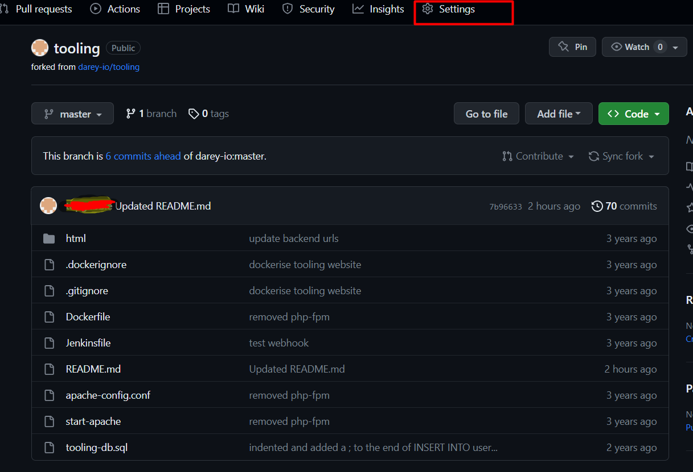
7. Click on add WebHook and input the code below

        http://<Jenkins private-ip>:8080/GitHub-webhook    
    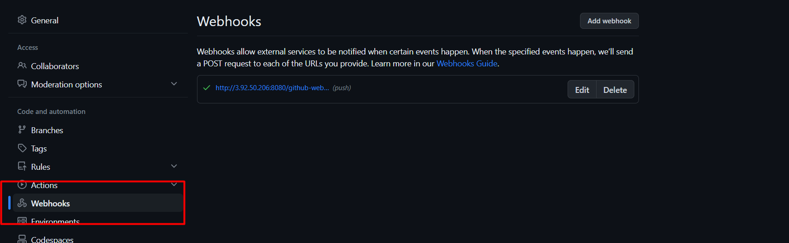
8. Click on the new item option on the Jenkins webpage and create a freestyle project.
9. In the source code management section, paste the GitHub repo URL, provide the GitHub credentials and save

10. On the Jenkins homepage, click on the job/project and select configure option.
11. Navigate to the built trigger option and check the GitHub hook trigger for GITSCM polling
    
12. Configure the Post build actions  to archive all the files – files resulted from a build are called “artifacts”.
    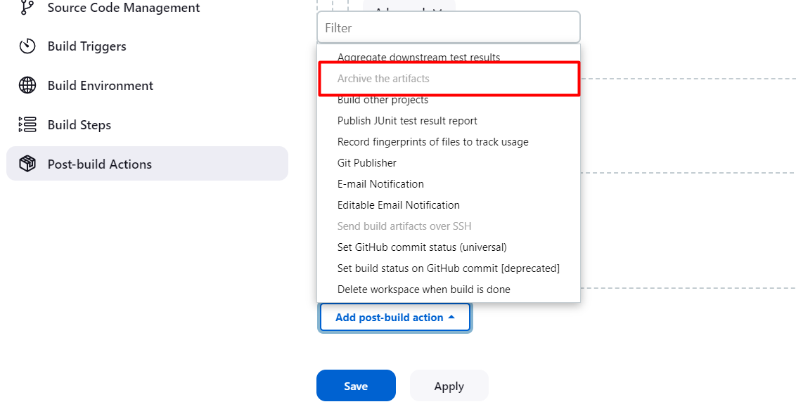
13. Configure a Post-build job to save all (**) files
    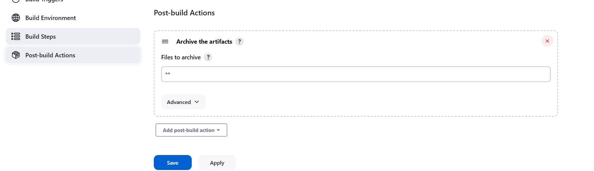
14. Make a change on readme file in the GitHub repo and this should automatically trigger a build in our Jenkins server.
    .

## Setup SSH agent

To enable our Ansible SSH into target servers from Jenkins-Ansible host server, we need to implement SSH-agent. This process involves adding our instance private key to our local RSA key.

1. The command below to start SSH-agent in the background.

        eval `ssh-agent -s`
    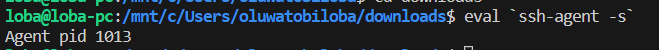
2. To add the instance private key to the local key, use:

        ssh-add <path-to-private-key>
    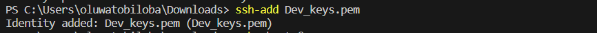
3. You can confirm the key has been successfully added by running

        ssh-add -l
    
4. Once set-up is completed, you can SSH into any instance without the instance SSH client.

           ssh -A <instance-name>@<instance-private-ip>

## Creating the Ansible playbook

1. Update the inventory/dev.YML file with the details of the target servers
    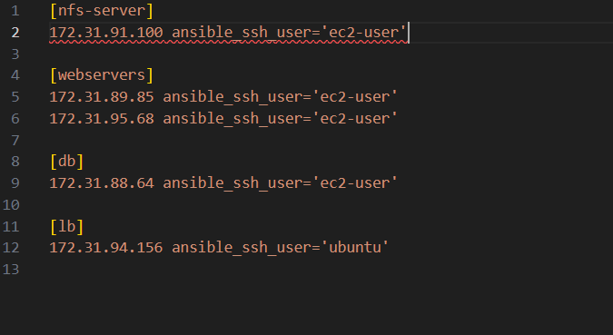.
2. Next steps is to create our intended playbook in the common.yml file.
3. The `playbook/commom.yml` is updated with the code below.

        ---
         - name: update web, nfs and db servers
           hosts: webservers, nfs, db
           remote_user: ec2-user
           become: yes
           become_user: root
           tasks:
             - name: ensure Wireshark is at the latest version
               yum:
                 name: wireshark
                 state: latest

         - name: update LB server
           hosts: lb
           remote_user: ubuntu
           become: yes
           become_user: root
           tasks:
             - name: Update apt repo
               apt: 
                 update_cache: yes

             - name: ensure Wireshark is at the latest version
               apt:
                 name: wireshark
                 state: latest

4. create a new branch branch off main branch

        git checkout -b <branch name>
    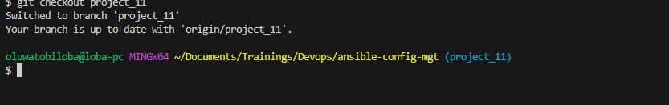
5. From the project_11 branch, commit and push your code to the main branch

        git status
        git add .
        git commit -m <commit message>
        git push orgin <your current branch name>

    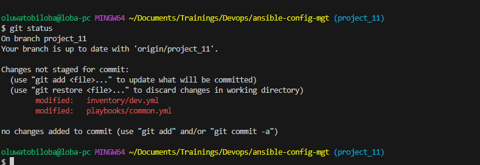
    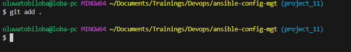
    
    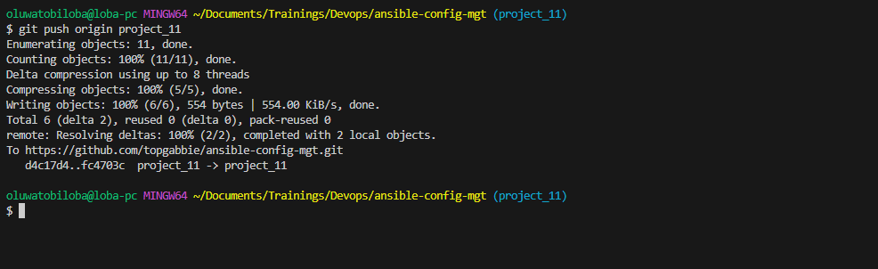
6. Pull the pushed repo and merge it to the main branch from the GitHub webpage.
7. The marge will automatically trigger a build in ansible.

    
8. To confirm if out artifact is in our Jenkins-Ansible server, us the command below

        /var/lib/jenkins/jobs/ansible/builds/<build_number>/archive/

### Connection to the Jenkins-Ansible server via VsCode for remote testing of Playbook

1. Go to the extensions section of the VScode, search and download remote development extension.
    
2. Click on the remote window and the left corner of the VSCode and click on connect to host from the options displayed

    
    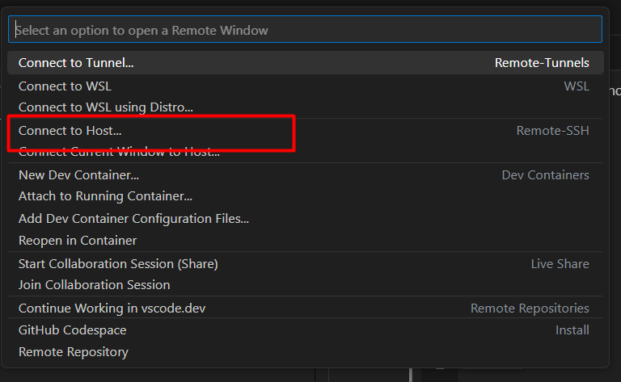
3. Click on configure host file and provide details of the remote server.
     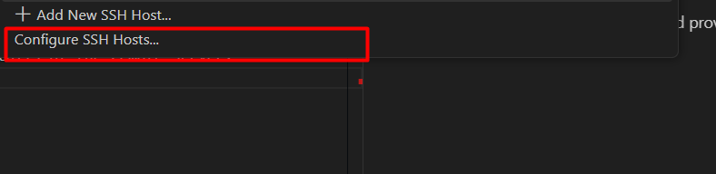

     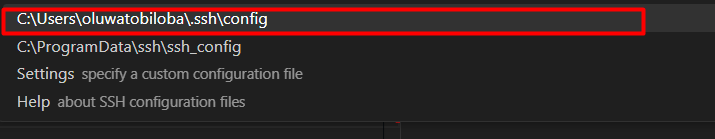

     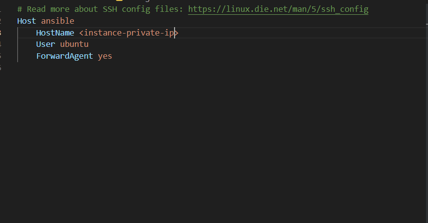
4. Save the config file and connect to the remote instance.
     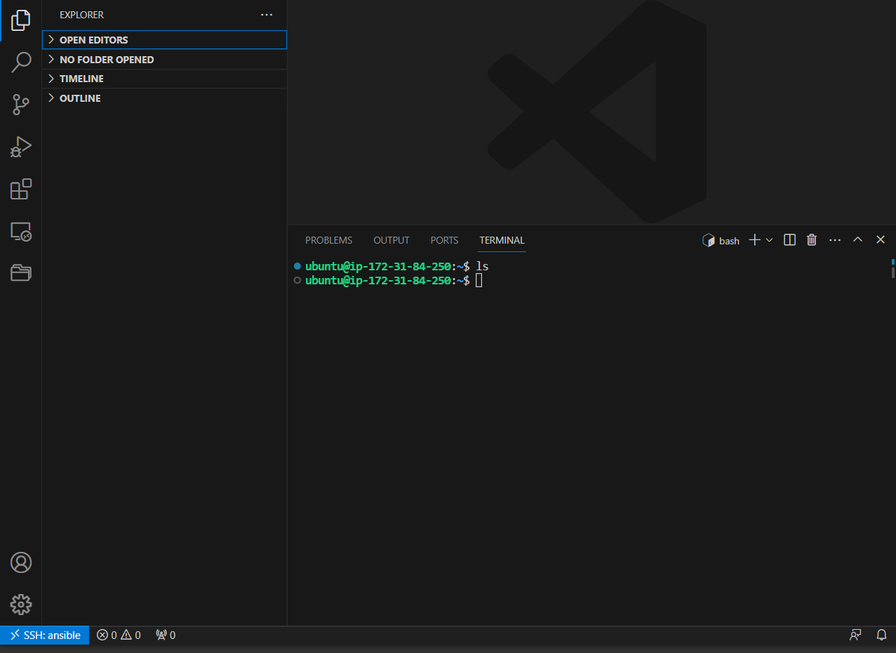
5. cd to the Jenkins build achieve as shown in step 8

    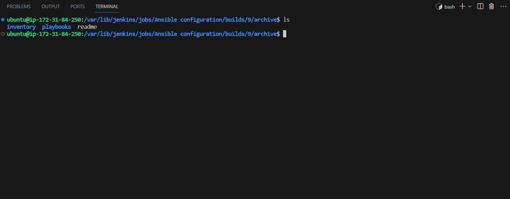
6. Run the command below to run the playbook.

        ansible-playbook -i inventory/dev.yml playbooks/common.yml

    
7. **END**